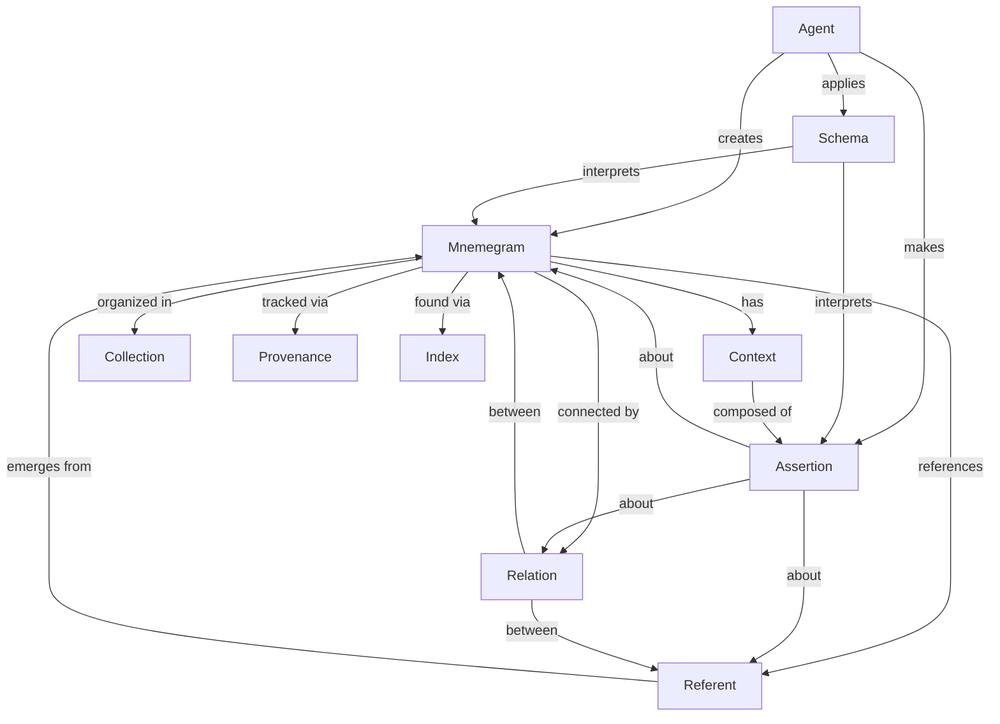
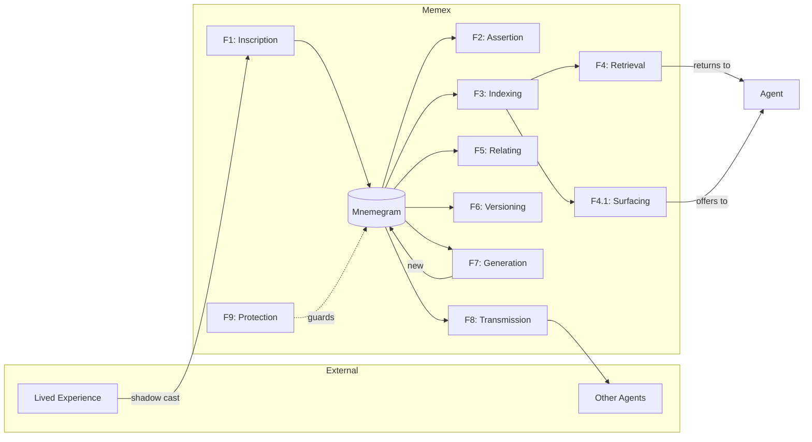

# Memex Ontology: Relations Supplement

## Primitive Element Relations

How the primitive elements relate to each other:

---

## Information Flow

How information moves through the memex:

---

_Relations supplement to "[[An Ontology of Memex]]"_
